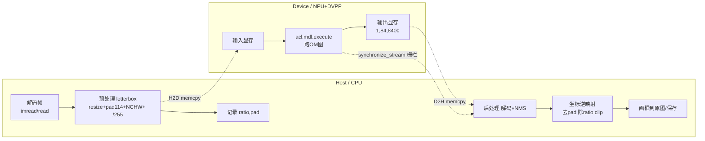

# 一帧图的旅程 · ACL 推理执行数据流图

> 目的：把「一张图进 NPU、一串框出来」这条黑盒链路，讲成能在脑中逐帧播放的**数据流模型**。
> 对照两套实现：
> - **参考骨架**：`mindsdk-referenceapps/VisionSDK/YOLOv7Detection/main.cpp` + `plugin/Yolov7PostProcess.cpp`（C++ / MxBase 封装）
> - **本项目实现**：`edge-perception-bench/scripts/infer_yolo_acl.py`（Python / 裸 ACL API）
>
> 对应 `docs/技术路线.md` 前置学习 ①②④⑤ 与 ⑤ 的「执行原则映射表」；也是 R1 周志「下一步学习目标」#1、#2 的落地物。

---

## 0. 一句话心智模型

> **像素在 Host 上被"整理成模型想要的形状"，一次性搬进 Device，NPU 闷头算完把结果一次性搬回 Host，剩下的"翻译成能画框的坐标"又全在 Host 做。**
> 全程只有 **2 次跨总线拷贝（H2D、D2H）+ 1 个真正的同步栅栏（execute 之后）**，其余都是 Host 的 CPU 活或 Device 的 AI Core / DVPP 活。

---

## 1. 全景数据流图

### 1.1 泳道图（Host ⇄ Device）

```
        ┌────────────────────── HOST (CPU) ──────────────────────┐   ┌─────── DEVICE (NPU / DVPP) ───────┐
 帧像素   imread / VideoCapture.read  → BGR uint8 H×W×3 (720×1280) │   │                                    │
        │                                │                       │   │                                    │
 预处理   resize(保比例) → 贴到 640×640 灰边(114) 画布 → HWC→CHW     │   │                                    │
        │ → /255 → float32 → NCHW (1,3,640,640)                  │   │                                    │
        │                                │ 记录 ratio, pad        │   │                                    │
        │                                ▼                       │   │                                    │
 搬运 H2D  aclrt.malloc(DEVICE) ◀═══════════════════════════════════════ 分配 device 输入缓冲
        │  aclrt.memcpy(H2D) ────────────────────────────────────────▶  输入张量落进 Device 显存
        │                                │                       │   │                                    │
 计算     aclrt.malloc 输出缓冲          │                       │   │  acl.mdl.execute  ← AI Core 跑 OM 图 │
        │                                │                       │   │  输出 (1,84,8400) 留在 Device        │
        │                                │                       │   │        ▲                           │
 栅栏     aclrt.synchronize_stream(0) ◀═══════════════════════════════  等 execute 真正算完（异步→同步点）    │
        │                                │                       │   │                                    │
 搬运 D2H  aclrt.memcpy(D2H) ◀────────────────────────────────────────  把输出张量拷回 host np.array        │
        │                                ▼                       │   │                                    │
 后处理   squeeze/transpose(8400,84) → 解码 cxcywh→xyxy → 置信度过滤   │   │                                    │
        │ → NMS → 【坐标逆映射回原图】(x-pad)/ratio + clip           │   │                                    │
        │ → 画框到 原始 720×1280 帧 → 保存                            │   │                                    │
        └────────────────────────────────────────────────────────┘   └────────────────────────────────────┘
```

**边界只有两条竖线**：左边是"应用进程/Python 解释器/OpenCV"，中间 `memcpy` 是 Host↔Device 唯一通道，右边是"AI Core + DVPP"。框歪、延时长，八成问题都在**跨线时机**和**坐标空间**上。

### 1.2 Mermaid（可渲染版）



---

## 2. 六个阶段逐个拆解（在哪跑 · 张量形状 · 关键 API · 为什么）

| # | 阶段 | 在 Host 还是 Device | 输入 → 输出（形状） | 关键 API（本项目 / MindSDK） | 为什么这么做 |
|:-:|------|------|------|------|------|
| 1 | **解码 Decode** | Host（OpenCV）/ 或 Device（DVPP JJPEGD） | 文件字节 → BGR uint8 `H×W×3`(720×1280×3) | 本项目 `cv2.VideoCapture.read()`；MindSDK `imageProcessor.Decode()` | 拿到原始像素；DVPP 解码可省 Host 拷贝 |
| 2 | **预处理 Preprocess** | **Host**（本项目）/ **Device-DVPP**（MindSDK） | `720×1280×3` → `1×3×640×640` float32，**并记录 `ratio`、`pad`** | 本项目 `preprocess()`；MindSDK `DvppPreprocessor*/OpenCVPreProcessor` | 缩放保比例+补边到模型固定输入；`ratio/pad` 是后面还原坐标的**唯一线索**，这步不记，后处理必歪 |
| 3 | **H2D 拷贝** | Host→Device 跨总线 | host float32 缓冲 → device 显存 | `acl.rt.malloc` + `acl.rt.memcpy(H2D)`；MindSDK `Image::ToDevice()` / `MxbsMallocAndCopy` | NPU 只认 device 显存；这是**第一条**单向通道 |
| 4 | **推理 Execute** | **Device（AI Core）** | device 输入 `1×3×640×640` → device 输出 `1×84×8400` | `acl.mdl.load_from_file`+`acl.mdl.execute`；MindSDK `Model::Infer()` | 跑的是 **OM 离线编译图**（ATC 把 ONNX 编成 NPU 指令）；execute 是**异步入队** |
| 5 | **D2H 拷贝 + 栅栏** | Device→Host | device 输出 → host `np.ndarray` | `acl.rt.synchronize_stream(0)` → `acl.rt.memcpy(D2H)`；MindSDK `Tensor::ToHost()` | execute 没算完 memcpy 会拿到脏数据；**先 synchronize 再 D2H** 是硬顺序 |
| 6 | **后处理 Postprocess** | **Host** | host `(8400,84)` → 原图坐标框列表 | 本项目 `postprocess()`；MindSDK `Yolov7PostProcess::Process` | 解码 anchor-free 输出→过滤→NMS→**逆映射回原图**→可画 |

> 数据形状记忆点：**进 `1×3×640×640`（NCHW, float, 0~1），出 `1×84×8400`（84=4框+80类，8400=候选框数）**。

---

## 3. 逐行落位表 —— 把 `infer_yolo_acl.py` 钉到上面 6 个阶段

| 代码位置（行） | 调用 | 属于阶段 | 在跑的地方 | 一句话：在干嘛 / 为什么在这同步 |
|---|---|:-:|---|---|
| L40-46 `AclContext.__init__` | `acl.init` / `rt.set_device` / `rt.create_context` | 前置 | Host 发起,Device 建 | 建起"能往 NPU 发活"的会话；context 是后续所有 malloc/execute 的落点 |
| L61 `load_from_file` | `acl.mdl.load_from_file` | 4 前置 | Device | 把 **OM 图**加载进 device，拿 `model_id`；不是加载权重而是加载编译好的执行图 |
| L64-73 `create_desc`/`get_*_dims` | `mdl.get_desc` 等 | 4 前置 | Host | 从模型元数据读出输入/输出的**形状与字节数**，后面按它 malloc、校验尺寸 |
| L109 `ascontiguousarray(float32)` | numpy | 2/3 | Host | 保证内存连续且 dtype 匹配模型输入，否则 memcpy 过去是乱的 |
| L111-112 size 校验 | — | 3 | Host | 主动比对 `arr.nbytes == input_sizes[i]`，把"喂错尺寸"挡在拷贝前 |
| L114 `rt.malloc(size,0)` | `acl.rt.malloc` | 3 | Device | 在 device 显存开输入缓冲 |
| L118 `rt.memcpy(...,H2D)` | `acl.rt.memcpy` | 3 | 跨总线 | **第一条通道**：像素搬进 NPU |
| L121/130 `create_data_buffer` | `acl.create_data_buffer` | 4 | Host 记账 | 把裸指针包成"数据桶"，供 dataset 描述 |
| L134-142 `create_dataset/add_dataset_buffer` | `mdl.create_dataset` | 4 | Host 记账 | 组装输入/输出 dataset（execute 的入参结构） |
| **L145 `acl.mdl.execute`** | 推理 | 4 | **Device** | **把整张图丢给 AI Core，异步入队**，返回不代表算完 |
| **L146 `rt.synchronize_stream(0)`** | 栅栏 | 4→5 | Device→Host 对齐 | **真正的同步点**：阻塞到这里 device 才真算完，之后才能安全读输出 |
| L152-156 `rt.memcpy(...,D2H)` + reshape | `acl.rt.memcpy` | 5 | 跨总线 | **第二条通道**：结果 `(1,84,8400)` 拷回 host 并 reshape |
| L161-178 `finally` destroy/free | `destroy_*`/`rt.free` | 清理 | Device+Host | 释放 device 显存与 dataset；不 free 会漏显存、多帧必炸 |
| L231-232 `squeeze/transpose` | numpy | 6 | Host | 把 `(84,8400)` 摆成每行一个候选框 `(8400,84)` |
| L234-240 解码+置信过滤 | numpy | 6 | Host | `[:,:4]` 取 cx,cy,w,h；`[:,4:]` 取 80 类分数，argmax 选类、mask 掉低分 |
| L244-256 cxcywh→xyxy + NMS | `cv2.dnn.NMSBoxes` | 6 | Host | 中心宽高转角点、去重叠框。**注意 NMSBoxes 要 `[x,y,w,h]`，喂 `[x1,y1,x2,y2]` 是历史 bug** |
| **L265-272 坐标逆映射** | numpy | 6 | Host | `(x - pad)/ratio` + clip，把 640 letterbox 空间的框**还原回原图**——框歪的根源就在这步与前处理记的 `ratio/pad` 对不对得上 |

---

## 4. 参考骨架 vs 本项目实现 对照（⑤ 执行原则表）

| 流水线环节 | MindSDK（C++ / MxBase） | 本项目（Python / 裸 ACL） | 差异要点 |
|---|---|---|---|
| 初始化 | `MxInit()` | `acl.init/set_device/create_context` | MxBase 把 context 细节藏进对象 |
| 解码 | `ImageProcessor::Decode()`（DVPP） | `cv2.VideoCapture.read()`（OpenCV） | DVPP 在 device 侧解码，省 H2D 前拷贝 |
| 预处理 | `DvppPreprocessor*`（device 上 resize/paste） | `preprocess()`（host 上 numpy/cv2） | **本项目预处理在 Host，是延时常被忽略的大头** |
| Device 内存 | `MemoryHelper::MxbsMalloc` | `acl.rt.malloc` | 同义 |
| H2D | `MxbsMallocAndCopy` / `Image::ToDevice` | `acl.rt.memcpy(H2D)` | 同义 |
| 推理 | `Model::Infer()`（内部封装 load+execute+sync） | `mdl.load_from_file`+`mdl.execute`+`synchronize_stream` | 本项目**显式写出同步栅栏**，MxBase 把它吞进 Infer |
| D2H | `Tensor::ToHost()` | `acl.rt.memcpy(D2H)` | 同义 |
| 后处理 | `Yolov7PostProcess::Process`+`NmsSort` | `postprocess()`+`cv2.dnn.NMSBoxes` | 算法不同（YOLOv7 vs v8 输出布局），坐标逆映射逻辑一致 |
| 补边对齐 | `leftOffset/16*16`、`topOffset` 取偶（DVPP paste 约束） | `dw//2`、`dh//2`（居中） | ⚠ **对齐规则不同 → 逆映射必须各自匹配自己前处理，否则框偏移** |

---

## 5. 内存与同步模型（三类内存 + 两条通道 + 一个栅栏）

- **三类内存**：
  - `MEMORY_HOST`：进程 malloc/numpy 的普通内存，NPU 看不见。
  - `MEMORY_DEVICE`：`aclrtMalloc` 开的显存，AI Core 读写；输入/输出张量住这。
  - `MEMORY_DVPP`：DVPP 图像域专用显存，**要求地址 256/128 对齐、宽高对齐**（这就是 MindSDK 里 `ALIGN_LEFT=16`、memset 背景、YUV 分量的由来）。
- **两条通道**：`memcpy H2D`（进）与 `memcpy D2H`（出），是 Host 与 Device 唯一的数据交换，量越大越慢，是延时大户之一。
- **一个栅栏**：`mdl.execute` 只是把任务**排进 stream 0 的队列**，函数返回 ≠ 算完。想读结果必须先 `synchronize_stream`。**忘了同步 → 拷回的是上一帧或全 0**。

---

## 6. 坐标系的三次搬运（框偏移的真正考点）

一个框这辈子换过 3 个坐标系，**前后必须用同一套 `ratio/pad` 正反换算**：

```
原图 (1280×720)
   │ ① 前处理：保比例缩放 r=min(640/720,640/1280)=0.5 → 640×360；居中补边 pad_top=(640-360)/2=140, pad_left=0
   ▼
letterbox 640×640 空间（模型看到的、也是它输出框所在的空间）
   │ ② NPU 推理（不关心坐标语义，只挪数字）
   ▼
输出框 (x1,y1,x2,y2) 仍在 640 letterbox 空间
   │ ③ 后处理逆映射：x_原 = (x_框 - pad_left)/r ；y_原 = (y_框 - pad_top)/r ；再 clip 到 [0,1280]×[0,720]
   ▼
原图坐标 → 才能正确画回 720×1280 的帧上
```

**自检worked example**（与 R1 周志数字一致）：
letterbox 空间框 `[83.25, 358.5, 261.5, 497.5]`，`r=0.5, pad_left=0, pad_top=140`
→ 原图 `[166.5, 437.0, 523.0, 715.0]`（`x/0.5`、`(y-140)/0.5`），正是修复后框住驾驶员的那组数。

> **W2 框歪的本质**：老代码前处理把 1280×720 **直接 resize 成 640×640 正方形**（拉变形、没有 ratio/pad 概念），后处理却把 640 空间的框**直接画到 720×1280**，等于跳过了 ③，坐标全错位；附带把 `[x1,y1,x2,y2]` 喂给了要 `[x,y,w,h]` 的 `NMSBoxes`。**理解了"三次搬运"，就再不会犯这类错。**

---

## 7. DVPP vs OpenCV 预处理（R7 会实测，这里先埋点）

| 维度 | OpenCV 预处理（本项目现状，在 Host） | DVPP 预处理（MindSDK，在 Device） |
|---|---|---|
| 谁干活 | CPU + numpy/cv2 | AI 芯片上的 DVPP 图像单元 |
| 数据流 | 原图 H2D 前就变成 NCHW 再拷 | 压缩图 H2D → device 上解码/缩放/补边 |
| 优点 | 实现简单、灵活、好 debug | 释放 CPU、延时低、适合多路并发 |
| 代价 | 大图 resize 吃 CPU、拷贝多 | 对齐/内存布局约束复杂、debug 难 |
| 对基准的意义 | 单帧延时里**前处理可能比 NPU 计算还久** | R7 的对比实验正是要量化这个差 |

> 你项目 `main()` 里 `t0..t1` 只夹了 `model.run()`（H2D+execute+sync+D2H），**不含 `preprocess`/`postprocess`**。所以报出的 27.1ms 是"推理调用"延时，不是端到端单帧延时——这是最容易读错的坑，记进 R4 profiling 时要分清。

---

## 8. 脱稿自述清单（学习目标的验收：能讲清 = 懂）

合上文档，逐条用自己的话讲出来，讲不出的就是盲区：

1. 一帧图从磁盘到出框，跨过几次 Host↔Device 边界？分别是什么操作？
2. 为什么 `mdl.execute` 之后、读输出之前，必须 `synchronize_stream`？不加会怎样？
3. OM 文件和 ONNX 文件有什么区别？`load_from_file` 加载的到底是什么？
4. `preprocess` 返回的 `ratio` 和 `pad` 有什么用？丢了会发生什么？
5. 输出张量 `(1,84,8400)` 的 84 和 8400 各代表什么？为什么要 transpose？
6. 本项目和 MindSDK 的补边对齐规则哪里不同？为什么逆映射必须匹配自己的前处理？
7. 报出的 latency 覆盖了哪几段、漏了哪几段？

---

## 9. 待补（给 R4 / R7 留位）

跑通样例后用 `msprof` 采集，填这张表，验证本心智模型与真实一致：

| 阶段 | 实测耗时 | 占比 | 在 Host/Device | 备注 |
|---|---|---|---|---|
| 预处理 preprocess | _待测_ | | Host | 疑似大头，重点量 |
| H2D memcpy | _待测_ | | 跨总线 | 与输入字节数线性相关 |
| execute（AI Core） | _待测_ | | Device | 模型本体 |
| D2H memcpy | _待测_ | | 跨总线 | 输出 (84,8400) 不小 |
| 后处理 postprocess | _待测_ | | Host | NMS 视候选框数量 |
